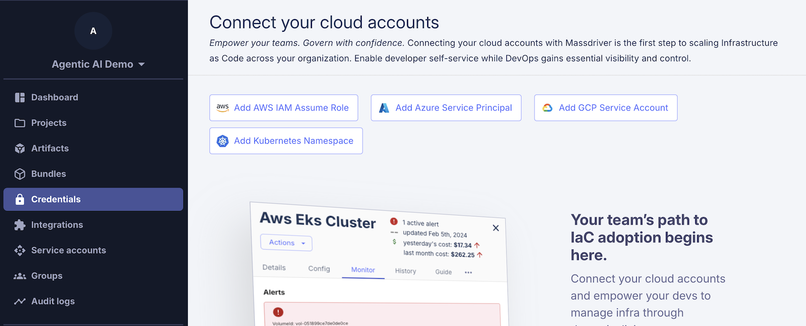

# Agentic Infrastructure Tutorial

A step-by-step walkthrough for building infrastructure with AI agents safely and effectively.

**Context**: This tutorial accompanies the Massdriver + Claude Code fireside chat "Making Infrastructure Safe for Agents" with Kelsey Hightower (March 18, 2026).

> [!tip] **Live Session PR**
> Want to see exactly what was built during the fireside chat? Check out the [pull request from the live session](https://github.com/massdriver-cloud/massdriver-catalog/pull/new/0318-live-session) against the [Massdriver Catalog](https://github.com/massdriver-cloud/massdriver-catalog) — real bundles, built live with Claude Code.

> [!note] **Watch the Recording**
> Missed the live session? Watch Kelsey Hightower and the Massdriver team build production-grade infrastructure bundles from scratch with Claude Code — [full recording on YouTube](https://www.youtube.com/live/DAzSiqoiTkg).

## What We're Building

A TODO API consisting of:
- **DynamoDB table** - Custom Massdriver bundle with artifact definition exposing ARN and IAM policies
- **Lambda function** - Custom bundle that consumes the DynamoDB artifact to serve the TODO app

AI can generate Infrastructure as Code, but that doesn't automatically make it production-ready or trustworthy. This tutorial demonstrates how Massdriver acts as a harness between AI agents and your cloud - providing the guardrails, context, and isolation that make agentic infrastructure practical.

---

## Prerequisites

- Docker installed locally
- Anthropic API key (for Claude Code)
- AWS account (for deploying infrastructure)

---

## Part 1: Massdriver Account Setup

### 1.1 Sign Up & Create Organization

Visit [app.massdriver.cloud](https://app.massdriver.cloud) and sign up with GitHub or Gmail. Create your organization during signup.

### 1.2 Create Service Account

The service account provides API access for CLI and agent authentication.

1. Navigate to **Service Accounts** in the sidebar
2. Click **Create service account**
3. Name it (e.g., `claude-agent`)
4. Copy and save the API key securely


### 1.3 Get Your Organization ID

Hover over your organization logo in the Massdriver UI to find your organization's short identifier (e.g., `acme-corp`).

---

## Part 2: Install CLI & Publish AWS Platform

### 2.1 Install the Massdriver CLI

```bash
brew install massdriver
```

### 2.2 Configure Authentication

```bash
mkdir -p ~/.config/massdriver
cat > ~/.config/massdriver/config.yaml << EOF
version: 1
profiles:
  default:
    organization_id: YOUR_ORG_ID
    api_key: YOUR_SERVICE_ACCOUNT_API_KEY
EOF
```

Replace `YOUR_ORG_ID` and `YOUR_SERVICE_ACCOUNT_API_KEY` with your values from Part 1.

### 2.3 Clone the Massdriver Catalog

The [massdriver-catalog](https://github.com/massdriver-cloud/massdriver-catalog) is your platform foundation. It contains artifact definitions, bundle templates, and cloud platform integrations.

```bash
git clone https://github.com/massdriver-cloud/massdriver-catalog.git
```

### 2.4 Publish the AWS Platform

This defines how Massdriver authenticates with AWS using IAM roles.

```bash
cd massdriver-catalog
make publish-platforms
```

This publishes the platform definitions to your Massdriver instance.

**Important**: After publishing, you'll see **AWS IAM Assume Role** in the credential type selector. Use this one, not the deprecated **AWS IAM Role** (`massdriver/aws-iam-role`) that exists on SaaS instances.

### 2.5 Add AWS Credential

Now add your AWS credential using the platform you just published:

1. Navigate to **Credentials** in the sidebar
2. Click **Add credential** and select **AWS IAM Assume Role**
3. Follow the guided setup to create an IAM role with the required permissions
4. Enter the Role ARN and External ID



---

## Part 3: Start Claude Code Environment

### 3.1 Clone This Repository

```bash
cd ..
git clone https://github.com/massdriver-cloud/agentic-infrastructure-tutorial.git
cd agentic-infrastructure-tutorial
```

### 3.2 Configure the Agent

Copy your Massdriver config for the agent container:

```bash
mkdir -p .massdriver
cp ~/.config/massdriver/config.yaml .massdriver/config.yaml
```

### 3.3 Set Environment Variables

**Optional** Add your API key here, or Claude will prompt for login at startup.

```bash
export ANTHROPIC_API_KEY="your-anthropic-api-key"
```

### 3.4 Start the Container

```bash
docker compose up -d
docker compose exec claude-code bash
```

The container includes:
- Claude Code CLI
- Massdriver CLI (with your service account credentials)
- The massdriver-catalog mounted at `/catalog`

Verify everything works:

```bash
mass project list
```

### 3.5 Install the Massdriver Plugin

Start Claude Code and install the plugin:

```bash
claude
```

**Follow the Claude login prompt.**

Then inside Claude Code:

```
/plugin marketplace add massdriver-cloud/claude-plugins
/plugin install massdriver@massdriver-cloud-claude-plugins
```

The plugin gives Claude structured context about your infrastructure - artifact contracts, dependency graphs, and IAM relationships.

---

## Part 4: Create the DynamoDB Bundle

Inside the container, run Claude Code and execute the development workflow:

```
/massdriver:develop Create an "aws-dynamodb-table" module with a fairly simple interface for managing a table. Make dangerous-to-change fields immutable, hard code most compliance recommendations from the Massdriver provisioner. Note, nothing in this git repo has been published besides the AWS platform.
```

Claude Code will scaffold the bundle, define the artifact schema, run Checkov compliance checks (iterating until they pass), and publish with `--development`.

---

## Part 5: Create the Lambda Bundle

Now create a Lambda function that consumes the DynamoDB artifact:

```
/massdriver:develop Create an "aws-lambda-todo-api" bundle — a Node.js Lambda behind API Gateway HTTP API that implements a TODO REST API. Connect to the DynamoDB artifact to get the table name and attach one of its exposed IAM policies. Bundle manages its own S3 deployment bucket. No custom domain, no VPC, no Route 53.
```

The Lambda doesn't define its own DynamoDB permissions - it pulls them from the artifact. This is the contract in action.

---

## The Guardrails

A `tofu plan` is a promise made by a machine that has never actually tried the thing it's promising. Real validation requires deployment against actual infrastructure. But you can't let agents touch production.

Massdriver solves this with **disposable environments** - isolated, temporary clones where agents can deploy, test, and iterate against real infrastructure feedback.

### Blast Radius Containment

The plugin operates in isolated test environments only. Agent failures impact disposable infrastructure, never production. The workflow:

1. **Clone** - Agent gets a low-scale replica with separate IAM boundaries
2. **Test** - Agent deploys and runs real compliance checks
3. **Validate** - Agent reports deployment logs and compliance results
4. **Approve** - Human reviews the infrastructure module
5. **Execute** - Developers deploy the vetted artifact to production
6. **Destroy** - Test resources torn down; artifact persists

### Forced Development Flag

Bundles cannot be published without the `--development` flag. Agent-created infrastructure is clearly marked as experimental until human review.

### Compliance Automation

Every bundle runs through Checkov security scanning. The agent iterates on failures until all checks pass. Security isn't optional - it's built into the feedback loop.

### Structured Context

The plugin understands your infrastructure as queryable data:
- **Artifact contracts** - What infrastructure exposes and consumes
- **Dependency graphs** - How components connect
- **IAM relationships** - Least-privilege access from artifact definitions

This context lets the agent make informed decisions without exploratory API calls.

### Audit Trail

Every deployment includes a message via the `-m` flag, creating a record of what was deployed and why.

---

## What You Actually Get

See the [actual PR with generated bundles](https://github.com/massdriver-cloud/massdriver-catalog/pull/32) from running this tutorial.

The two bundles generated total ~850 lines of code:

**DynamoDB bundle** (~330 lines):
- OpenTofu config with point-in-time recovery, encryption at rest, and deletion protection hardcoded
- Dangerous fields (table name, hash key, billing mode) marked immutable so they can't be changed through the UI
- Read-only and read-write IAM policies auto-generated and exposed through the artifact

**Lambda bundle** (~520 lines):
- S3 deployment bucket with versioning, KMS encryption, and public access blocks
- IAM execution role with least-privilege policies
- CloudWatch log groups with configurable retention
- API Gateway HTTP API with access logging
- DynamoDB permissions pulled directly from the artifact - no manual IAM authoring

The Lambda doesn't define its own DynamoDB permissions. It consumes them from the DynamoDB artifact's policy list. Change the DynamoDB bundle's policies, redeploy, and every consumer gets the update.

Writing this from scratch - with proper compliance controls, IAM policies scoped correctly, immutability guards, and working artifact contracts - would take an experienced engineer a day or two. The agent produced it in the time it took to answer a few clarifying questions.

**Developers never touch this workflow.** The AI helps platform engineers translate intent into IaC. Once you're happy with compliance and developer experience, you approve the bundle into a stable release. From there, developers get an interactive canvas that governs their cloud - all your compliance and non-negotiables intact, fully reproducible, repeatable, and auditable. Everything is backed by open source: OpenTofu, OCI, and Docker for maximum portability and zero lock-in. The IaC becomes the deterministic contract. AI understood your intent; developers consume the result.

---

## Learn More

- [Massdriver AI](https://www.massdriver.cloud/ai) - How Massdriver acts as the harness between AI agents and your cloud
- [Development Environments for Agentic Infrastructure](https://www.massdriver.cloud/blogs/development-environments-for-agentic-infrastructure) - Deep dive on disposable environments and blast radius containment

## Reference

| Topic | URL |
|-------|-----|
| Getting Started | https://docs.massdriver.cloud |
| CLI Reference | https://docs.massdriver.cloud/reference/cli/overview |
| Artifacts | https://docs.massdriver.cloud/concepts/artifacts |
| Artifact Definitions | https://docs.massdriver.cloud/concepts/artifact-definitions |
| Bundle Development | https://docs.massdriver.cloud/bundles/development |
| Claude Plugin | https://github.com/massdriver-cloud/claude-plugins |
| Massdriver Catalog | https://github.com/massdriver-cloud/massdriver-catalog |
